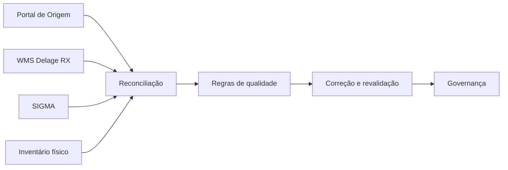
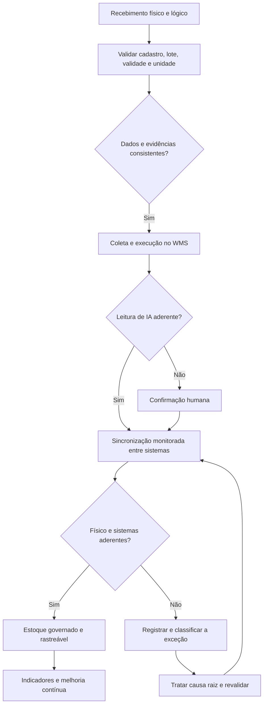

# Data Quality aplicada à Operação Logística

  

  <strong>Saneamento cadastral • Reconciliação físico × sistema • Governança de estoque • AS-IS / TO-BE</strong>

  <a href="https://laismoreira07.github.io/case-data-quality-logistica/">Visualizar o estudo de caso</a>
  ·
  <a href="#documentação">Documentação</a>
  ·
  <a href="#competências-aplicadas">Competências</a>

> **Nota de confidencialidade:** estudo de caso baseado em uma experiência profissional real. O cliente, a localidade, os registros operacionais e as evidências originais foram omitidos ou transformados. Os exemplos visuais e a base deste repositório são sintéticos. Delage RX e SIGMA são citados apenas como tecnologias presentes no contexto analisado; as observações referem-se à configuração e ao uso encontrados no projeto, não a uma avaliação geral dos produtos.

## Resumo executivo

Este projeto documenta uma iniciativa de diagnóstico operacional, saneamento de dados e reconciliação de estoque em um centro de distribuição com requisitos de controle, qualidade e rastreabilidade. O trabalho conectou inventário físico, processos logísticos, regras de negócio e dados provenientes de diferentes fontes.

O escopo inicialmente estimado em aproximadamente **4 mil SKUs** foi ampliado após o diagnóstico em campo e alcançou cerca de **7,8 mil SKUs**. Como não havia uma única fonte automaticamente confiável, a validação combinou evidências físicas, dados cadastrais e registros do Portal de Origem, WMS Delage RX e SIGMA.

| Evidência do projeto | Síntese |
|---|---|
| Escopo real | Aproximadamente **7,8 mil SKUs** |
| Expansão do escopo | Quase **2×** a estimativa inicial |
| Fontes conciliadas | **4** fontes físicas e sistêmicas |
| Diagnóstico | **12 GAPs críticos** agrupados em três categorias |
| Qualidade de dados | **6 dimensões** avaliadas |

## Demonstração visual

<picture>
  <source media="(max-width: 640px)" srcset="assets/demo-mobile.gif">
  
</picture>

*Demonstração conceitual reconstruída com dados fictícios. Nenhuma tela, registro ou imagem do ambiente real foi utilizada.*

## Desafio

A operação apresentava divergências entre estoque físico e saldos sistêmicos, baixa padronização de dados mestres e dependência de validações manuais. O diagnóstico avaliou lote, validade, fabricante, unidade de medida, fornecedor, posição de estoque, integrações, disponibilidade das plataformas e comportamento do recurso nativo de IA empregado na coleta.

## Diagnóstico: 12 GAPs críticos

| Categoria | GAPs | Síntese |
|---|---:|---|
| **Processos e operação física** | 01 e 04 | Mistura de lotes e posições bloqueadas ou alocadas |
| **Dados mestres e governança** | 02, 03, 05 e 07 | Evidências fotográficas, duplicidades, padronização e dependência do cadastro |
| **Tecnologia, integrações e infraestrutura** | 06, 08, 09, 10, 11 e 12 | Conversões, validações, disponibilidade, IA, mudanças e segregação de ambientes |

1. **Mistura de lotes:** formação de pallets com lotes diferentes, afetando rastreabilidade e FEFO.
2. **Governança de fotos:** evidência genérica sem associação suficiente a lote, endereço, embalagem ou unidade.
3. **Sobrescrita de evidências:** substituição de imagens anteriores e perda do histórico visual.
4. **Posições alocadas ou bloqueadas:** impedimentos para movimentação e atualização do saldo físico.
5. **Governança cadastral:** duplicidades e divergências em fabricantes, unidades e máscaras.
6. **Integração Portal × Delage RX:** parametrizações e conversões gerando quantidades inconsistentes.
7. **Dependência do cadastro mestre:** coletores propagando erros existentes na origem.
8. **Validações preventivas insuficientes:** ausência de travas na entrada do processo.
9. **Disponibilidade das plataformas:** instabilidades causando paradas e atrasos.
10. **Leitura de lotes por IA:** divergências exigindo intervenção manual autorizada.
11. **Gestão de mudanças:** alterações sistêmicas sem comunicação prévia suficiente.
12. **Segregação de ambientes:** inconsistência de direcionamento entre homologação e produção.

O efeito combinado produzia retrabalho, perda de produtividade, divergências físico × sistema e risco de rastreabilidade. O detalhamento está em [Diagnóstico de qualidade dos dados](docs/03-diagnostico-data-quality.md).

## Dimensões de qualidade avaliadas

- **Completude:** presença dos atributos necessários para identificar e movimentar o item.
- **Consistência:** compatibilidade entre sistemas e realidade física.
- **Unicidade:** prevenção de duplicidades de item, fornecedor e cadastro.
- **Validade:** aderência de datas, lotes e regras de shelf life.
- **Acurácia:** correspondência entre quantidade, embalagem, unidade e posição.
- **Rastreabilidade:** capacidade de reconstruir origem, tratamento e movimentação.

## Jornada aplicada

| Etapa | Atuação | Evidência gerada |
|---|---|---|
| Descoberta | Acompanhamento em campo, entrevistas e observação dos fluxos | Mapa do cenário AS-IS |
| Inventário | Conferência física e identificação dos atributos críticos | Base de divergências |
| Reconciliação | Comparação entre fontes e classificação das inconsistências | Matriz físico × sistema |
| Saneamento | Padronização, correção e revalidação dos registros | Dados tratados e regras de validação |
| Redesenho | Definição de controles, responsabilidades e fluxo futuro | Cenário TO-BE e backlog |
| Governança | Indicadores, procedimentos e acompanhamento de reincidências | Modelo de melhoria contínua |

## Arquitetura da solução — Modelo TO-BE

O cenário futuro migra de ajustes reativos para um modelo baseado em prevenção na origem, governança de dados, supervisão humana e rastreabilidade ponta a ponta.

### Camadas de controle

1. **Dados mestres:** dicionário de atributos, unicidade, conversões e aprovação cadastral.
2. **Operação física:** segregação de lotes, endereçamento válido e aplicação de FEFO.
3. **Sistemas e evidências:** histórico fotográfico, regras de precedência e reconciliação.
4. **IA e coleta digital:** supervisão humana, registro de divergências e telemetria funcional.
5. **Infraestrutura e mudanças:** segregação de ambientes, change management e contingência.

## Supervisão humana e telemetria funcional da IA

No diagnóstico, as respostas do recurso nativo de IA foram comparadas às evidências físicas. O TO-BE recomenda registrar sistematicamente as divergências de leitura, incluindo categoria, resultado apresentado, resultado confirmado, intervenção e data da ocorrência.

> **Taxa de falha da IA = (leituras divergentes ÷ leituras validadas) × 100**

Quando houver baixa confiança, conflito com a evidência física ou reincidência de um padrão, a ocorrência deve seguir para confirmação humana antes da atualização definitiva dos sistemas. Essa abordagem de *Human-in-the-Loop* reduz o risco de propagação silenciosa de inconsistências e gera evidências para monitoramento, ajuste de parâmetros e evolução do recurso.

## Resultados e entregas

### Evidências quantitativas publicadas

- escopo real de aproximadamente **7,8 mil SKUs**;
- volume próximo do dobro da estimativa inicial de aproximadamente **4 mil SKUs**;
- conciliação de **quatro fontes**: Portal de Origem, Delage RX, SIGMA e inventário físico;
- identificação e estruturação de **12 GAPs críticos**.

### Entregas realizadas

- diagnóstico sistêmico e operacional baseado em evidências;
- mapeamento AS-IS/TO-BE dos fluxos críticos do centro de distribuição;
- classificação de causas e riscos relacionados às divergências;
- regras para validação de lote, validade, fabricante, unidade, fornecedor e posição;
- avaliação operacional do recurso nativo de IA utilizado na coleta;
- relatórios comparativos entre estoque físico e sistemas;
- procedimentos, recomendações de governança e direcionamento para indicadores;
- alinhamento entre operação, área técnica e responsáveis pelo processo.

### Controles recomendados no TO-BE

- matriz de riscos e plano de ação 5W2H;
- prevenção de inconsistências na origem;
- gestão estruturada de exceções e evidências;
- revalidação obrigatória após o saneamento;
- telemetria funcional e supervisão humana sobre a IA;
- medição de reincidência e melhoria contínua.

> O case não atribui percentuais de acurácia ou melhoria sem linha de base, fórmula documentada e medição formal comparável. Benefícios do TO-BE são apresentados como resultados esperados, não como ganhos já realizados.

## Indicadores de sustentabilidade recomendados

| Indicador | Fórmula sugerida | Objetivo |
|---|---|---|
| Acurácia de estoque | (SKUs sem divergência ÷ SKUs inventariados) × 100 | Medir aderência físico × sistema |
| Completude cadastral | (Registros completos ÷ registros avaliados) × 100 | Acompanhar atributos obrigatórios |
| Divergências por categoria | (Total por causa ÷ total de divergências) × 100 | Priorizar causas raízes |
| Taxa de reincidência | (Ocorrências repetidas ÷ ocorrências tratadas) × 100 | Avaliar eficácia da correção |
| Tempo de tratamento | Data de conclusão − data de identificação | Medir eficiência do saneamento |
| Falha de leitura/IA | (Leituras divergentes ÷ leituras validadas) × 100 | Monitorar confiabilidade funcional |
| Itens sem posição válida | (SKUs sem endereço ÷ SKUs inventariados) × 100 | Melhorar endereçamento e produtividade |

## Fluxo integrado da transformação operacional

<picture>
  <source media="(max-width: 640px)" srcset="assets/fluxo-integracao-mobile.gif">
  
</picture>

*A versão mobile percorre os blocos em recortes próprios para preservar a legibilidade. [Abrir o flowchart completo em alta resolução](assets/flowchart-integracao-operacional.jpg).*

## Competências aplicadas

`Business Analysis` `Data Quality` `Data Governance` `Data Cleansing` `Data Validation` `Data Reconciliation` `Master Data` `BPMN` `AS-IS / TO-BE` `Supply Chain` `WMS` `Root Cause Analysis` `Human-in-the-Loop` `Lean Six Sigma` `Gestão de Stakeholders`

## Documentação

1. [Contexto e desafio](docs/01-contexto-e-desafio.md)
2. [Metodologia e execução](docs/02-metodologia-e-execucao.md)
3. [Diagnóstico de qualidade dos dados e 12 GAPs](docs/03-diagnostico-data-quality.md)
4. [Processos AS-IS e arquitetura TO-BE](docs/04-processos-as-is-to-be.md)
5. [Indicadores, resultados e critérios de evidência](docs/05-indicadores-e-resultados.md)
6. [Governança, riscos, IA e aprendizados](docs/06-governanca-riscos-aprendizados.md)
7. [Guia de publicação no GitHub Pages](docs/07-guia-publicacao.md)

## Base demonstrativa

O arquivo [`data/amostra_inventario_sintetica.csv`](data/amostra_inventario_sintetica.csv) contém registros fictícios criados exclusivamente para demonstrar as regras de qualidade descritas neste case. Ele não deriva de exportações, capturas ou dados do ambiente real.

## Autoria

**Laís Carolline Pinto Moreira**  
Business Analyst | Data, Systems & Process Analyst  
[LinkedIn](https://www.linkedin.com/in/lais-moreira-lm1698/) · [Portfólio no GitHub](https://github.com/laismoreira07)
