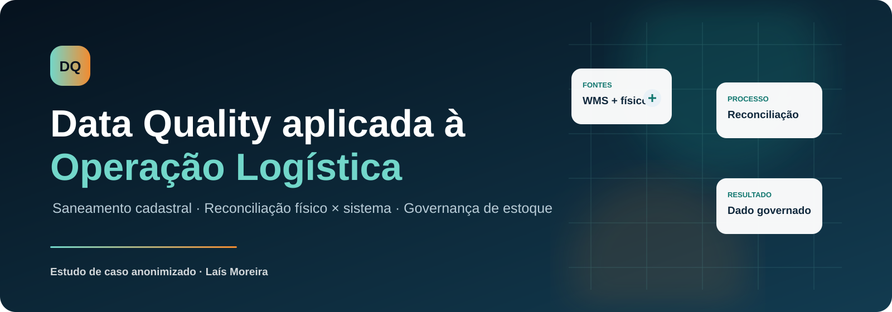
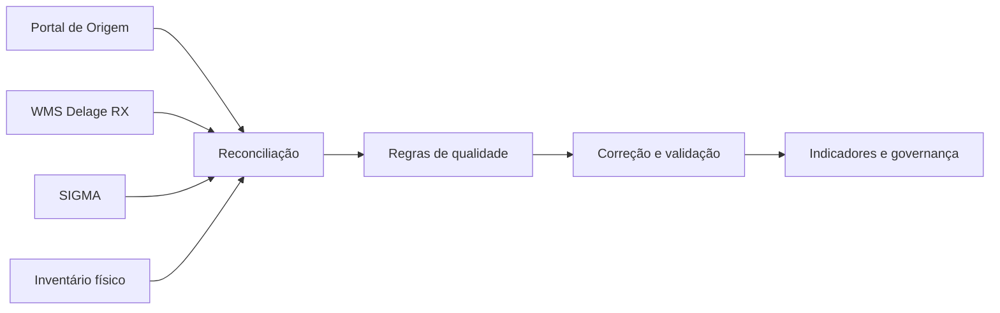
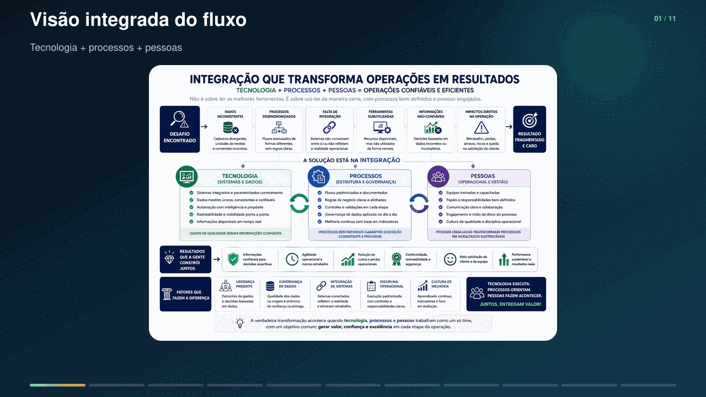

# Data Quality aplicada à Operação Logística

  

  <strong>Saneamento cadastral • Reconciliação físico × sistema • Governança de estoque • AS-IS / TO-BE</strong>

  <a href="https://laismoreira07.github.io/case-data-quality-logistica/">Visualizar o estudo de caso</a>
  ·
  <a href="#documentação">Documentação</a>
  ·
  <a href="#competências-aplicadas">Competências</a>

> **Nota de confidencialidade:** estudo de caso baseado em uma experiência profissional real. O cliente, a localidade, os registros operacionais e as evidências originais foram omitidos ou transformados. Os exemplos visuais e a base disponível neste repositório são sintéticos. Delage RX e SIGMA são citados apenas como tecnologias presentes no contexto analisado; as observações referem-se à configuração e ao uso encontrados no projeto, não a uma avaliação geral dos produtos.

## Visão geral

Este projeto documenta uma iniciativa de diagnóstico operacional, saneamento de dados e reconciliação de estoque em um centro de distribuição inserido em ambiente regulado. O trabalho conectou inventário físico, processos logísticos, regras de negócio e dados provenientes de diferentes fontes para ampliar a confiabilidade e a rastreabilidade das informações usadas pela operação.

O escopo inicialmente estimado foi significativamente ampliado após o diagnóstico em campo: o volume real aproximou-se do dobro da previsão inicial e alcançou cerca de **7,8 mil SKUs**. Como não havia uma única fonte confiável, a validação precisou combinar evidências físicas, dados cadastrais e registros sistêmicos.

## Demonstração visual

<picture>
  <source media="(max-width: 640px)" srcset="assets/demo-mobile.gif">
  
</picture>

*Demonstração conceitual reconstruída com dados fictícios. Nenhuma tela, registro ou imagem do ambiente real foi utilizada.*

## Desafio

A operação apresentava divergências entre estoque físico e saldo sistêmico, baixa padronização de dados mestres e dependência de validações manuais. Entre os pontos analisados estavam:

- lotes, validade, fabricante e unidade de medida;
- fornecedores e cadastros duplicados;
- ausência ou inconsistência de posições de estoque;
- diferenças entre embalagem, fracionamento e quantidade registrada;
- aderência entre Portal de Origem, WMS Delage RX, SIGMA e inventário físico;
- comportamento do recurso nativo de IA utilizado no fluxo de coleta e validação;
- indisponibilidades, exceções operacionais e dependência de conhecimento tácito.

## Fontes conciliadas

## Fluxo integrado da transformação operacional

O flowchart abaixo apresenta a visão executiva do case: os problemas de dados e processo geram uma operação fragmentada; a integração entre tecnologia, processos e pessoas cria controles, confiabilidade e resultados sustentáveis.

<picture>
  <source media="(max-width: 640px)" srcset="assets/fluxo-integracao-mobile.gif">
  
</picture>

*A versão mobile percorre os blocos em recortes próprios para preservar a legibilidade. [Abrir o flowchart completo em alta resolução](assets/flowchart-integracao-operacional.jpg).*

## Jornada aplicada

| Etapa | Atuação | Evidência gerada |
|---|---|---|
| Descoberta | Acompanhamento em campo, entrevistas e observação dos fluxos | Mapa do cenário AS-IS |
| Inventário | Conferência física e identificação dos atributos críticos | Base de divergências |
| Reconciliação | Comparação entre fontes e classificação das inconsistências | Matriz físico × sistema |
| Saneamento | Padronização, correção e revalidação dos registros | Dados tratados e regras de validação |
| Redesenho | Definição de controles, responsabilidades e fluxo futuro | Cenário TO-BE e backlog |
| Governança | Indicadores, procedimentos e acompanhamento de reincidências | Modelo de melhoria contínua |

## Dimensões de qualidade avaliadas

- **Completude:** presença dos atributos necessários para identificar e movimentar o item.
- **Consistência:** compatibilidade entre os sistemas e a realidade física.
- **Unicidade:** prevenção de duplicidades de item, fornecedor e cadastro.
- **Validade:** aderência de datas, lotes e regras de shelf life.
- **Acurácia:** correspondência entre quantidade, embalagem, unidade e posição.
- **Rastreabilidade:** capacidade de reconstruir origem, tratamento e movimentação.

## Resultados e entregáveis

- consolidação de um diagnóstico sistêmico e operacional baseado em evidências;
- mapeamento AS-IS/TO-BE dos fluxos de recebimento, armazenagem, separação e inventário;
- classificação das causas de divergência e dos riscos associados;
- regras para validação de lote, validade, fabricante, unidade de medida, fornecedor e posição;
- tratamento funcional das ocorrências relacionadas ao uso de IA no processo de coleta;
- relatórios comparativos entre estoque físico e sistemas;
- procedimentos operacionais, recomendações de governança e direcionamento para indicadores;
- treinamento e alinhamento entre operação, área técnica e responsáveis pelo processo.

> O case não atribui percentuais de melhoria sem medição formal de antes e depois. Os resultados quantitativos publicados restringem-se ao volume aproximado efetivamente mapeado.

## Competências aplicadas

`Business Analysis` `Data Quality` `Data Governance` `Data Cleansing` `Data Validation` `Data Reconciliation` `Master Data` `BPMN` `AS-IS / TO-BE` `Supply Chain` `WMS` `Root Cause Analysis` `Lean Six Sigma` `Gestão de Stakeholders`

## Documentação

1. [Contexto e desafio](docs/01-contexto-e-desafio.md)
2. [Metodologia e execução](docs/02-metodologia-e-execucao.md)
3. [Diagnóstico de qualidade dos dados](docs/03-diagnostico-data-quality.md)
4. [Processos AS-IS e TO-BE](docs/04-processos-as-is-to-be.md)
5. [Indicadores e resultados](docs/05-indicadores-e-resultados.md)
6. [Governança, riscos e aprendizados](docs/06-governanca-riscos-aprendizados.md)
7. [Guia de publicação no GitHub Pages](docs/07-guia-publicacao.md)

## Base demonstrativa

O arquivo [`data/amostra_inventario_sintetica.csv`](data/amostra_inventario_sintetica.csv) contém registros fictícios criados exclusivamente para demonstrar as regras de qualidade descritas neste case. Ele não deriva de exportações, capturas ou dados do ambiente real.

## Autoria

**Laís Carolline Pinto Moreira**  
Business Analyst | Data, Systems & Process Analyst  
[LinkedIn](https://www.linkedin.com/in/lais-moreira-lm1698/) · [Portfólio no GitHub](https://github.com/laismoreira07)
