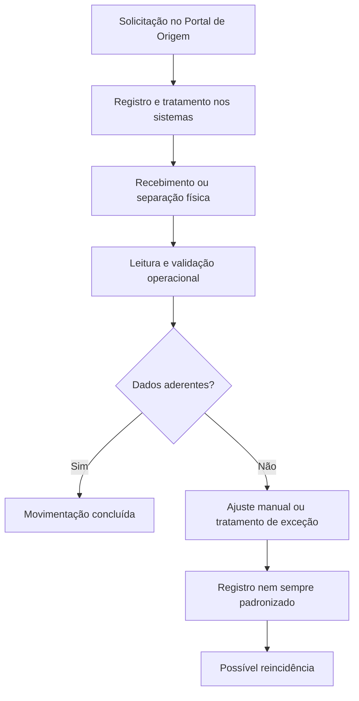
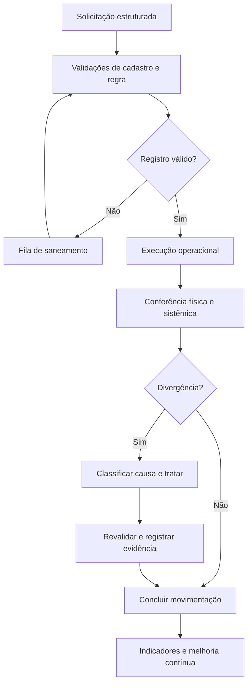

# 4. Processos AS-IS e TO-BE

## AS-IS consolidado

### Fragilidades principais

- validações distribuídas entre diferentes pessoas e fontes;
- dependência de conhecimento tácito;
- tratamento de exceções sem classificação única;
- risco de ajuste do saldo sem eliminação da causa;
- inconsistências descobertas tardiamente, durante separação ou inventário;
- resposta da IA necessitando conferência quando divergente da evidência física.

## TO-BE proposto

## Princípios do desenho futuro

1. **Prevenir antes de corrigir:** validar atributos críticos na entrada.
2. **Separar sintoma de causa:** não tratar toda divergência como ajuste de estoque.
3. **Registrar exceções:** manter categoria, responsável, evidência e decisão.
4. **Revalidar:** confirmar o resultado após qualquer correção.
5. **Medir reincidência:** observar se a mesma causa volta a ocorrer.
6. **Manter supervisão humana:** revisar resultados de IA em situações de baixa confiança ou conflito com evidências.

## Responsabilidades sugeridas

| Papel | Responsabilidade |
|---|---|
| Operação | Registrar evidência e executar a conferência física |
| Qualidade ou governança | Validar regra, causa e necessidade de saneamento |
| TI e sistemas | Tratar parametrização, integração e indisponibilidade |
| Dono do processo | Priorizar riscos e aprovar mudanças de procedimento |
| Gestão | Acompanhar indicadores, reincidências e plano de ação |

